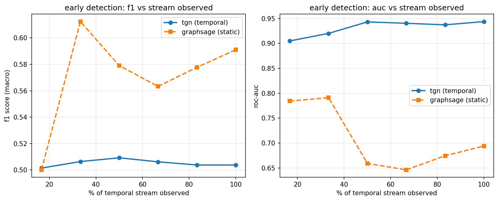

# temporal graph network for coordinated inauthentic behavior detection

live demo: https://aadihuria.github.io/tgn-bot-detection/

## the problem, explained without any of the jargon

Platforms try to catch fake accounts by looking at one account at a time and asking "does
this look fake?" — follower count, account age, does it have a profile photo, how often it
posts. The trouble is bot operators know exactly what those checks look for, so they build
accounts that clear every single one. Looked at alone, a well-made bot looks like a normal
person.

Here's the thing that's actually hard to fake: even when each individual account looks
fine, a *group* of accounts working together can't hide how they behave as a group. A real
person makes friends slowly, over weeks, through normal life. A bot farm gets switched on
and thirty accounts all follow the same handful of targets within a few hours of each
other, go quiet for two weeks, then all wake up together — and then do it again the next
week, and the week after. One coincidence like that could happen to real strangers. The
same group doing it over and over, in sync, across multiple separate bursts, is basically
impossible to happen by accident. That's the signature a bot operator can't avoid leaving
behind once they're running many accounts from one script — it's not really "created at
the same time" that gives them away (real people cluster around big events too), it's
"acted together, repeatedly, over time."

So the real question isn't "does this account look fake" — it's "does this account's
behavior over time, and the behavior of the group around it, look like something scripted
instead of something organic." Everything below is built around answering that instead of
the profile-snapshot question.

Two separate tools go after that timing signal directly:

1. a **temporal graph network (TGN)** — instead of judging an account from a frozen
   snapshot, this gives every account a "memory" that updates every time something happens
   to it, so it's scoring an account's *pattern of behavior over time*, not a fixed profile
2. a **burst coordination detector** — doesn't look at individual accounts at all. it maps
   out which accounts keep showing up together, doing the same thing, at the same time, and
   flags any cluster whose timing is too tightly synchronized to be a coincidence of
   separate real people

## about the data — read this before the results below

TwiBot-20 and TwiBot-22, the standard benchmarks for this task, both require emailing the
dataset authors and waiting for manual approval. That access hasn't come through as of this
writing. Rather than wait, everything in this repo was built and evaluated against a
**synthetic temporal graph generator** (`data/synthetic_generator.py`) written for this
project. It's seeded and reproducible, and it's deliberately built so account-level features
overlap heavily between bots and humans — the whole premise here is that per-account checks
should *not* be enough to solve this, so the generator doesn't hand that signal to the
model. Bot clusters get away with looking normal individually; only their timing gives them
away.

`data/pipeline.py` is a second loader written against the real TwiBot-20/22 file format
(`user.json` / `edge.csv` / `label.csv` / `split.csv`) so that swapping in the real dataset,
once access arrives, is a matter of pointing `train.py` at it instead of the generator — the
rest of the pipeline (feature engineering, burst features, model code) doesn't change.

**Every number below came from an actual run of `train.py` on this synthetic benchmark.**
Nothing here is projected or estimated. If the eventual TwiBot-22 numbers come out
differently — better or worse — that's what will get reported when that happens.

## architecture

```
synthetic generator / twibot loader
              │
              ▼
   feature engineering + burst features
   (data/pipeline.py — log-normalized counts,
   circadian time features, sliding-window burst stats)
              │
     ┌────────┴────────┐
     ▼                  ▼
graphsage baseline   tgn (memory + attention)
(static snapshot,    (chronological training,
 no time ordering)    node memory per account)
     │                  │
     └────────┬─────────┘
              ▼
   early detection eval
   (checkpoints at 10-100%
   of the observed stream)

burst coordination detector (separate path)
   co-follow graph → connected components →
   median inter-arrival gate → flagged clusters
              │
              ▼
       fastapi server (api/server.py)
       + static demo (docs/index.html)
```

## results (synthetic benchmark, seed=13)

7,028 accounts, 123,690 temporal edges, 628 bots across 25 coordinated clusters.

| metric | graphsage (static) | tgn (temporal) |
|---|---|---|
| f1 (macro, full stream) | 0.488 | 0.521 |
| roc-auc (full stream) | 0.597 | 0.959 |

auc is the metric to trust here over f1 — with bots at ~9% of labeled nodes, f1 at a fixed
0.5 decision threshold is a noisy statistic regardless of how good the underlying ranking
is. auc doesn't have that problem, and the gap there (0.60 static vs 0.96 temporal) is the
actual story: a model that can't see event ordering barely beats random on this benchmark,
one that can gets close to a clean separation.

(the tgn test-set count in `results/summary.json` is larger than the raw node count because
metrics are computed over every time a labeled node shows up in the chronological walk, not
deduplicated to one score per node — a account gets re-scored each time new edges touch it.)

**burst detector:** caught 18 of 25 injected bot clusters (72% recall) with 2 false
positives out of 19 flagged clusters, using nothing but connection timing — no node
features, no model weights, just the co-follow graph and a median inter-arrival threshold.

**early detection**, checking the tgn against the same static baseline at increasing
fractions of the observed edge stream:



the tgn's auc is already at 0.96+ by the 17% checkpoint and stays roughly flat from there —
on this benchmark, the coordinated bursts that give bot clusters away happen early and
repeatedly, so there isn't much of a "wait longer to be more sure" curve to show. that's
itself a reasonably interesting result and is worth re-checking once this runs on TwiBot-22,
where bot behavior is less scripted than a synthetic generator's.

## repo layout

```
data/
  synthetic_generator.py   synthetic temporal graph + labels
  pipeline.py               real twibot-20/22 loader + shared feature engineering
models/
  graphsage_baseline.py     static gnn baseline
  tgn_bot_detector.py       temporal graph network
detectors/
  burst_detector.py         cofollow graph + coordination scoring
evaluation/
  early_detection.py        checkpointed temporal evaluation
  export_demo_data.py       dumps results into docs/data/demo.json
api/
  server.py                 fastapi serving layer
  Dockerfile
docs/                        github pages demo (static, no backend)
tests/
train.py                     runs the whole thing end to end
```

## running it

```
pip install -r requirements.txt
python train.py                        # generates data, trains both models, runs eval
python -m evaluation.export_demo_data  # regenerates docs/data/demo.json
pytest tests/
```

everything is CPU-only and finishes in a few minutes on a laptop — the synthetic benchmark
is sized at ~7k nodes / ~125k edges specifically so a full run doesn't require a GPU.

running the api locally:

```
uvicorn api.server:app --reload
```

`POST /detect` with a list of accounts and temporal edges runs the burst detector over the
submitted subgraph and returns flagged accounts and clusters.

## what's still open

- **real dataset.** waiting on TwiBot-22 access (emailed the dataset authors). the loader
  in `data/pipeline.py` is ready for it; nothing else in the pipeline needs to change.
- **hosted api.** `api/server.py` + `api/Dockerfile` + `railway.json` are ready to deploy,
  that just hasn't been done yet — it's one `railway up` away.
- **tgn checkpoint in the api.** the live `/detect` endpoint currently runs the burst
  detector only, not the trained tgn, since there's no model checkpoint persistence yet and
  the honest thing was to not fake loading weights that don't exist on disk.
